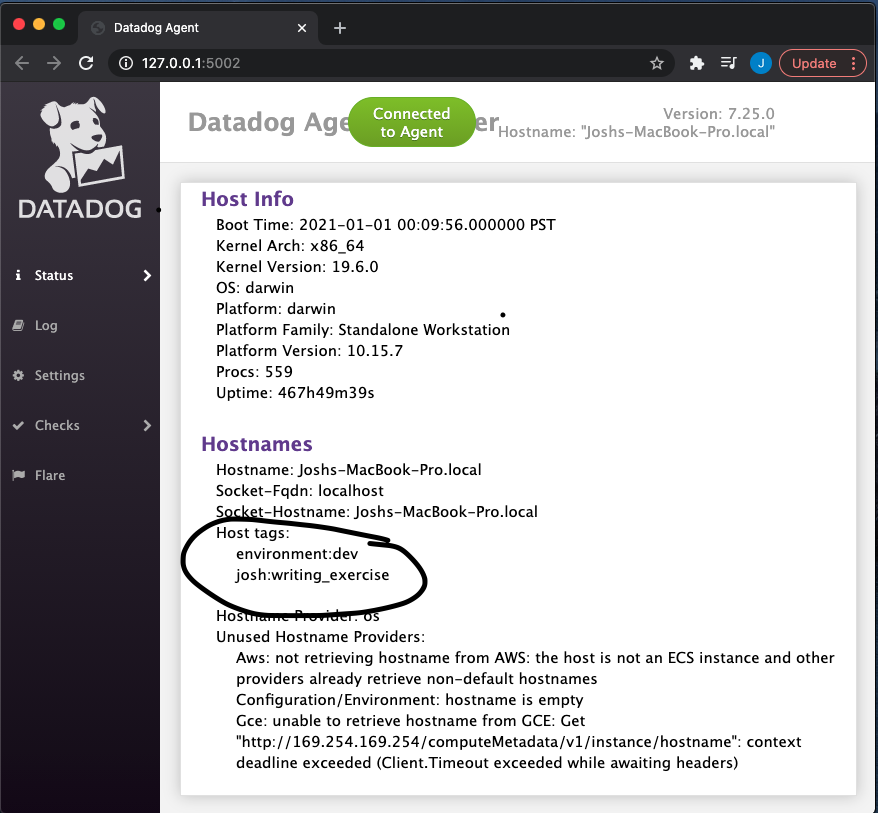

Your answers to the questions go here.

## Collecting Metrics

1. Add tags in the Agent config file and show us a screenshot of your host and its tags on the Host Map page in Datadog.

1. Install a database on your machine (MongoDB, MySQL, or PostgreSQL) and then install the respective Datadog integration for that database.

[Screenshot of Successful Integration]()

1. Create a custom Agent check that submits a metric named my_metric with a random value between 0 and 1000.

1. Change your check's collection interval so that it only submits the metric once every 45 seconds.

1. **Bonus Question** Can you change the collection interval without modifying the Python check file you created?

## Visualizing Data

1. Utilize the Datadog API to create a Dashboard that contains:

- Your custom metric scoped over your host.
Any metric from the Integration on your Database with the anomaly function applied.

Please be sure, when submitting your hiring challenge, to include the script that you've used to create this Dashboard.

1. Once this is created, access the Dashboard from your Dashboard List in the UI:

- Set the Dashboards's timeframe to the past 5 minutes
- Take a snapshot of this graph and use the @ notation to send it to yourself.

- **Bonus Question:** What is the Anomaly graph displaying?

The Datadog community has written a substantial number of high-quality integrations and libraries. Select one from this page. With this selection in mind, write a blog post that announces your selection and explains the benefits it offers our users/community. The post should cover installation, configuration, usage, and best practices along with code samples where applicable. You should also thank the contributor for their effort.

